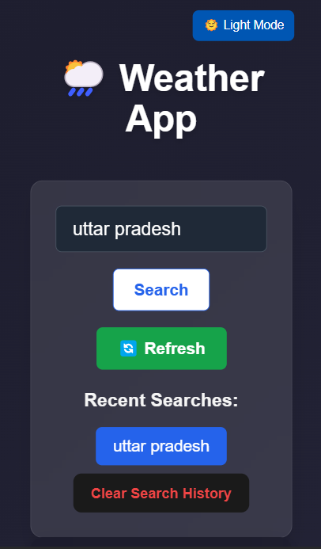
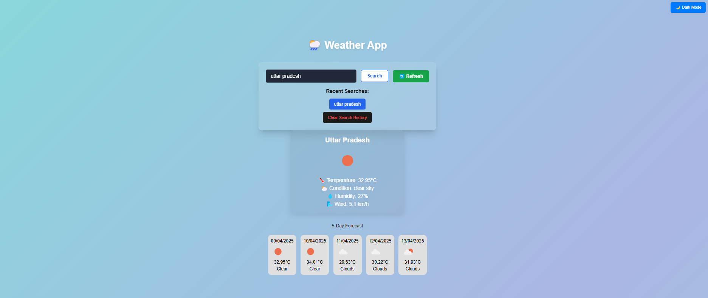

# 🌤️ Weather App

A sleek, responsive Weather Dashboard built using **React**, **Tailwind CSS**, and the **OpenWeatherMap API**. It allows users to search for any city and get current weather details along with a 5-day forecast.

📸 Screenshots
✅ Desktop View

📱 Mobile View


## 🔗 Live Demo

👉 [Click here to view the app](https://shivam-8200.github.io/weatherapp/)

---

## ⚙️ Features

- 🔍 **City-based Search** – Get weather info by entering a city name.
- 📅 **5-Day Forecast** – Displays upcoming weather conditions.
- 🌡️ **Live Temperature, Humidity & Wind Info**
- 🌓 **Dark/Light Background Animation**
- 📱 **Responsive Design** – Mobile and desktop friendly.
- ❌ **Error Handling** – Shows helpful error screen for invalid cities.

---

## 🛠️ Tech Stack

- **Frontend:** React + Tailwind CSS + Framer Motion
- **API:** OpenWeatherMap
- **Deployment:** GitHub Pages
- **Build Tool:** Vite

---

## 🚀 Getting Started

### 1. Clone the Repo

```bash
git clone https://github.com/Shivam-8200/weatherapp.git
cd weatherapp
